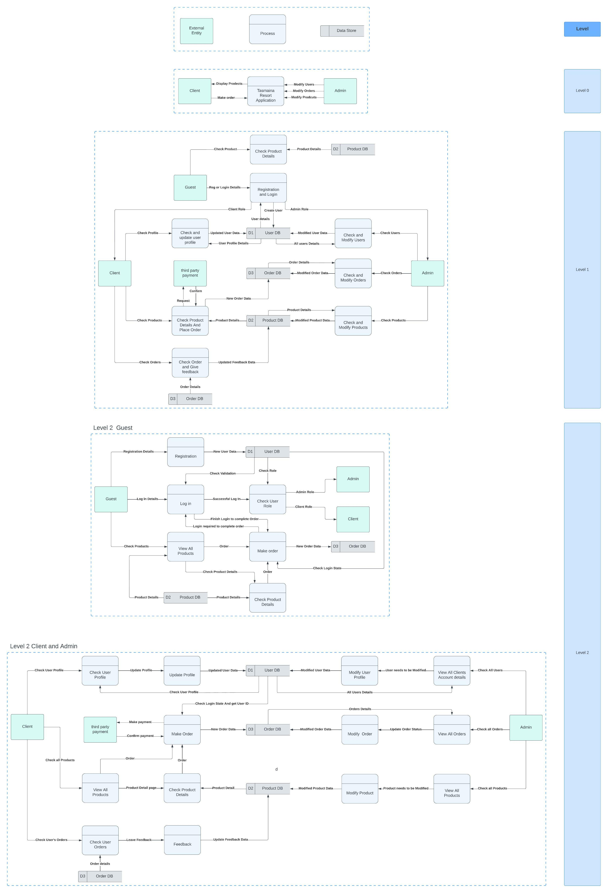
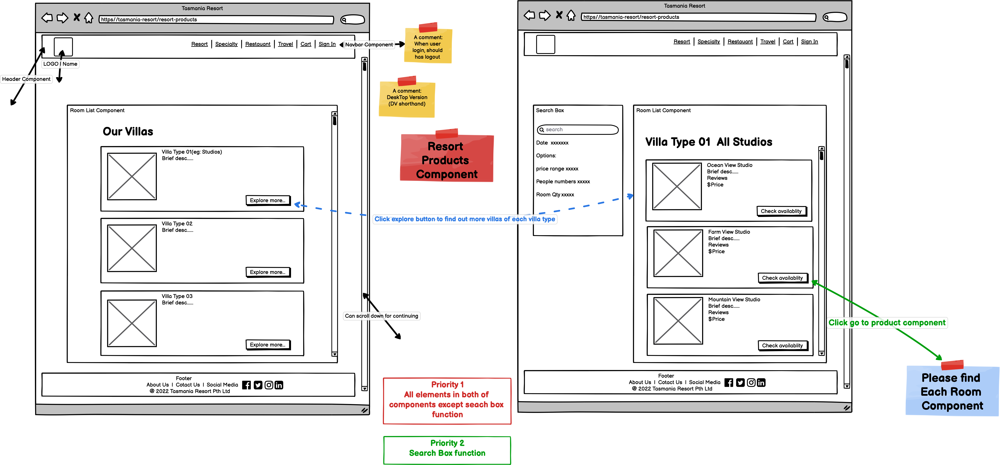
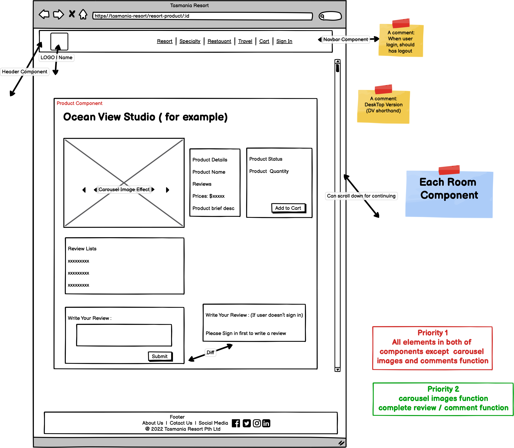
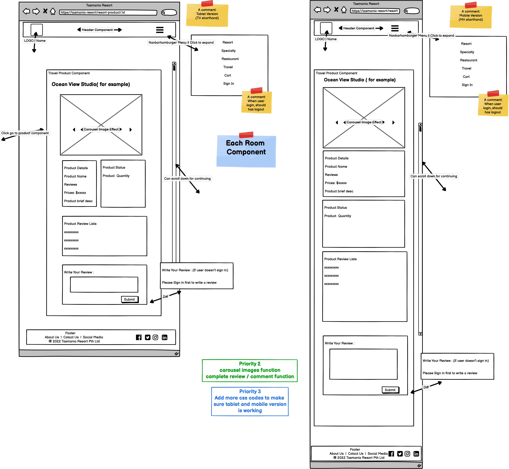
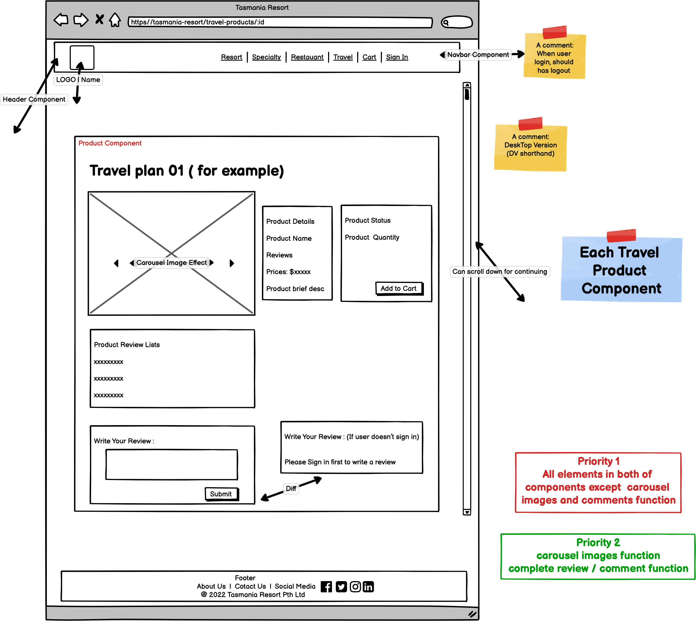
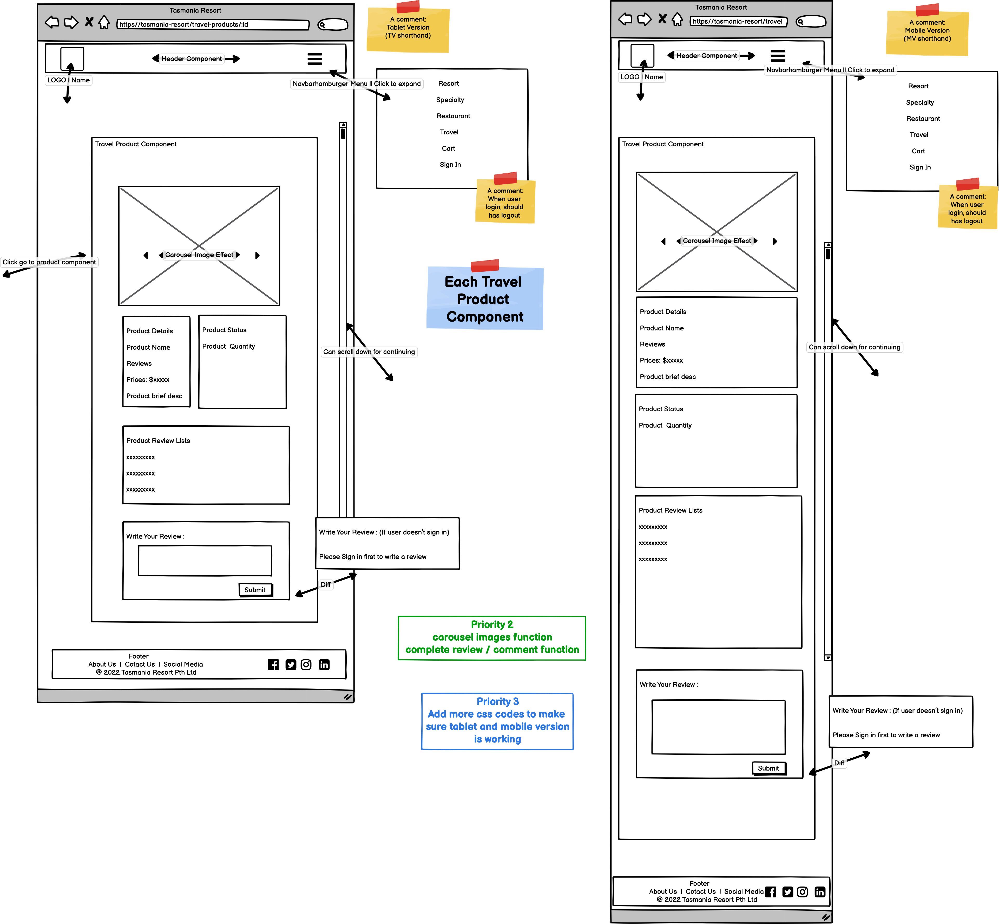
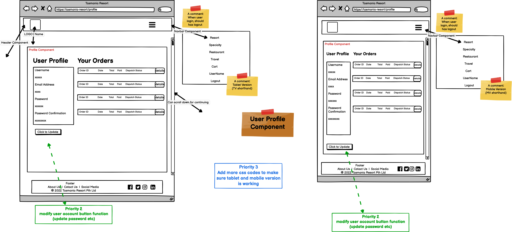

# T3A2-A - Tasmania Resort

## Purpose

Our client Tasmania Resort, came from humble beginnings and has now grown into a successful and diverse business, offering services to people who are looking for a one-stop shop travel solution for Tasmania.

In order to keep up with their ever-growing customer demand and tap into the online market, Tasmania Resort has approached us to design and build a full-stack web application to bring their business online. As such, the purpose of this website is to provide an online platform as a digital solution to enable the delivery of their offerings to customers everywhere.

The website will offer everything a customer could need for the trip such as researching the tourist destinations to plan their trip and get inspiration, purchasing local products and food, and booking accommodation and tour packages. It will also feature an easy to use online payment system to allow customers to make purchases from anywhere, anytime.

Additionally, administrative functions such as product and order management can be provisioned to staff accounts to provide a fully integrated solution for the resort.

## Functionality / features

### Functionality

  
 User management 

Priority 1:

1. This application will allow users to create their own accounts to save all their profiles.

2. User roles will be split into admin and client. Their role will have different administrative functions.

3. The user could open their own profile page to show the history of purchase and booking.

4. Users must log in before purchasing the item so that they will save purchase history.

Priority 2:

1. The user could leave their opinion or suggestion after they purchase the item. And the website will display them.

2. The user could freely change their password and upload their own profile picture.

If we have time :

- Admin will have their own page to work on.

<!-- Guests with different VIP levels have different discounts. -->

- Client accounts will have different VIP levels to get discounts or free services.

- Admin could send messages to other staff or leave group chat notices through this application.

- Show/download the schedule of client booking.

<!-- Booking room online -->

  
 Booking room online 

Priority 1:

1. This application will allow the client to book their villas online.

2. It will display all villa types with price and every vela type will have its detail pages.

3. Each villa can only book once at the same time.

4. Whenever the room is booked we should let staff confirm. The booking will be done whenever the staff confirms the booking.

Priority 2:

1. While vale is booked, show the unavailable tag at the villa on both the list and product detail page.

2. Search and filter.

3. It will have the payment function to organize the payment.

4. It will have the webhook to ensure the payment is successful.

if we have time:

- The application should show the staff how many rooms are used in the next few days and it should give the chef the number of people, to help them prepare the food.

<!-- Sell souvenirs online. -->

  
 Online souvenirs shopping 

Priority 1:

1. This application allows users to buy souvenirs online.

2. It will display all the items on the webpage and each item will have the product details page/pop-up.

Priority 2:

1. It will have a cart page to organize the purchase of products.

<!-- Online Checkout. -->

2. It will have the payment function to organize the payment.

3. It will have the webhook to ensure the payment is successful.

<!-- Choose your food. -->

  
 Food services 

Priority 1:

1. This application allows the user to choose or order their food.

2. It should display a menu to show customers.

Priority 2:

1. It will have the payment function to organize the payment.

2. It will have the webhook to ensure the payment is successful.

If we have time :

- It should give the staff or chef a message to show when and what the customer ordered. And chef could use the application to ensure the food is finished prepared and sent to the correct customer.

  
 Booking tour package

Priority 1:

1. This application could show the available tour package.

2. Each tour lane will have its own number limit and start/end time. Customers could book anyone they are interested in.

Priority 2:

1. Online checkout and webhook confirmation

If we have more time:

- Use API to check the upcoming weather.

### Features

  
 Online shopping 

  
Priority 1:

- Display the whole items and each item have its own details page.
- Staff could Update/Delete the items and change the quantity.

Priority 2:

- User could add item to their cart.

- Cart to let customers organize their purchases.

- Users could check out online.

  
  Display filter / search 

Priority 2:

- Booking page will have the time and price filler.
- All shopping pages will have a search bar to search the items or services.

  
  Signup and Signin 

Priority 1:

- User could sign up by using a unique email.
- User could log in by using email/username + password.

Priority 2:

- User could change and update their password.
- User could upload their profile picture to the cloud and use them.
- User could leave feedback and they will display with the item/services.

if we have time:

- User could use a google account to log in.

  
  Role Control 

  
Priority 1:

- User could split into two types of roles client and admin.

- Admin should be able to add, access, update and delete the item showing on the application.

- Client can only view and make orders.

- Guest can only view.

- Customer should display their purchase history.

- Admin could display all orders and confirm orders from this page.

  
  Cloud save pictures 

  
Priority 1:

- Pictures are stored locally

Priority 2:

- User uploads the picture to the could use them as profile pictures.

- Admin use upload to change the display picture for each item. This picture should save in the cloud as well.

  
 Payment and webhook. 

Priority 2:

- Application should let the user have the online payment. (PayPal, Strip...)

- Should have the webhook to track whether the payment is successful or not.

  
 Formate data and message system

If we have time:

- We could Formate data to pdf and allow user to download them.

- we could build an application chat feature.

- It allows customers could leave messages to staff and get askers.

- It allows staff to talk with each other and have group chat areas.

  
## Target Audience

This website is aimed at people who are looking for a one-stop shop travel solution for Tasmania with service offerings including accommodation, food, tours and shopping. The website is also for staff members at Tasmania Resort to perform operational tasks such as the management of product listings etc...

## Tech stack

### Front-end

- HTML, CSS, Javascript, React, Axios, Material-UI

### Back-end

- Node.js, Express.js

### Database

- MongoDB, mongoose, AWS S3

### Testing

- Jest

### Deployment

- Heroku

## Dataflow Diagram

## Application Architechture Diagram

## User Stories

### As a customer...

  
 Accommodation, food, local products & tour packages 

#### Priority 1 - Minimum viable product

- As a customer looking to stay at the hotel in Tasmania Resort, I want to book my hotel online so that it is easier to book my holiday.
- As a customer looking to book a hotel room, I want easy access to view all available room types offered by this resort given the specified dates so that it is easy to view and compare my options.
- As a customer who is interested in a specific room type, I want to be able to view more details about the room so that I can be informed about what I'm potentially buying.
- As a customer who likes to gift friends and family souvenirs from trips, I want to be able to purchase souvenirs online incase I forget to buy them or run out of luggage space on the way back home so that I don't go home empty-handed.
- As a customer looking to purchase some souvenirs, I want easy access to view all available souvenirs offered so that it is easy to view and compare my options.
- As a customer who is interested in a specific souvenir, I want to be able to view more details about the product so that I can be informed about what I'm potentially buying.
- As a customer looking to travel to Tasmania for a holiday, I want easy access to view all available tour packages offered by this resort so that it is easy to view and compare my options.
- As a customer who is interested in a specific tour package, I want to be able to view more details about the package so that I can be informed about what I'm potentially buying.
- As a customer who wants to dine at the resort, I want to be able to order food online so I can beat the rush at the restaurant.
- As a customer looking to order some food, I want easy access to view all available food offered so that it is easy to view and compare my options.
- As a customer who is interested in a particular dish, I want to be able to view more details about the dish so that I can be informed about what I'm potentially ordering.

#### Priority 2

- As a customer looking to book a room/make a purchase, I want to be able to search for what I need so that only items matching my search criteria are shown to me.

#### If we have more time

- As a customer who has questions regarding a product, I want to be able to live chat with a staff member so that my issue can be resolved as soon as possible.
- As a customer who has visited the resort many times, I want to be a part of a rewards program so that I can receive discounts for being a loyal customer.

  
 Account management 

#### Priority 1 - Minimum viable product

- As a customer who is going to make bookings and/or purchases, I want to be able to register for a new account so that I can make and track bookings/purchases.
- As a customer who is going to make bookings and/or purchases, I want to be able to sign in to my account so that I can view my purchases and bookings.

#### Priority 2

- As a customer who has an account, I want to be able to change my password whenever required so that I can retrieve my account even if I forget the current password.
- As a customer who has an account, I want to be able to upload a picture to use as my profile picture so that I can make my account more tailored to me.

#### If we have more time

- As a customer who doesn't want to create too many accounts, I want to be able to log in using my Google account so that I don't neet to remember the details of an additional account.

  
 Cart and Payment 

#### Priority 1 - Minimum viable product

- As a customer who is making a purchase/booking, I want to be able to make payment online so that I can still purchase the item without being at the resort in person.

#### Priority 2

- As a customer who has never bought from/stayed at Tasmania Resort before, I want to see reviews from previous customers to help guide me make a better decision.
- As a customer who is browsing the website, I want to be able to add items to a cart while I continue to browse so that I don't forget what I was going to buy.
- As a customer who wants to know how much I'm spending, I want to see all the items I'm purchasing and the total cost of these items in the cart so that I can double check before paying.
- As a customer who has trouble making decisions, I want to be able to add/remove the quantity of an item in the cart so that I don't have to be hassled by navigating through the website again.

  
 After purchase/booking 

#### Priority 1 - Minimum viable product

- As a customer who is spontaneous and changes travel plans from time to time, I want to be able to edit or cancel my hotel booking so that I can retain my flexible lifestyle without wasting too much money.
- As a customer who has made a purchase/booking, I want to be able to check the status of my order (i.e. Order/booking pending, order/booking confirmed etc...) so that I can manage my expectations.

#### Priority 2

- As a customer who has made a purchase/booking, I want to be able to leave comments on purchases that I've made or hotel rooms that I stayed in so that I can express my opinion and share my experience.

#### If we have more time

- As a customer who prefers using paper planners, I want to be able to view and download a copy of my accommodation and hotel bookings so that I can print it and add it to my planner.

### As the manager of Tasmania Resort...

#### Priority 1 - Minimum viable product

- As the manager who needs to delegate tasks, I want to be able to assign administration access to staff accounts so that they can perform administrative tasks such as editing product details.
- As the manager who manages the product offerings, I want to be able to add a new product (merchandise/hotel room type) for sale on the website so that they can be sold online when they are launched.
- As the manager who oversees the sales process, when a customer makes a purchase/books a room, I need to be able to confirm the sale before it is processed to ensure we don't overbook the hotel or oversell products.
- As the manager who knows when the peak travel seasons are, I want to be able to edit the details (price, description etc...) of the listings so that I can maximise profits for the resort.
- As the manager who needs to report sales performance to upper level management, I want to be able to see past sales of products and hotel rooms so that I can discuss them with my manager.
- As the manager who needs to ensure the accuracy of product offerings on our website, I want to be able to remove a product/room type from the website so that customers are not disappointed when they can no longer buy the product or book that type of hotel room.

#### If we have more time

- As a manager who wants to make the resort workflow more efficient, I want to be able to see how many rooms are booked over the coming days so that I can better predict how much food and hotel supplies will be required.
- As a manager, I want to be able to provision different admin function access to different staff members based on their role (e.g. chef, receptionist)

## Wireframes

  
Home Page

- #### Home Page (no need login)
- Desktop Version
  
- Tablet and Mobile Version
  

  
Products Page

- #### Our Villas Page (no need login)
- Desktop Version
  
- Tablet and Mobile Version
  

- #### Our Specialties Page (no need login)
- Desktop Version
  
- Tablet and Mobile Version
  

- #### Our Restaurant Page (no need login)
- Desktop Version
  
- Tablet and Mobile Version
  

- #### Our Travel Page (no need login)
- Desktop Version
  
- Tablet and Mobile Version
  

  
Each Product Page

- #### Each Villa Page (no need login)
- Desktop Version
  
- Tablet and Mobile Version
  

- #### Each Specialty Page (no need login)
- Desktop Version
  
- Tablet and Mobile Version
  

- #### Each Food Page (no need login)
- Desktop Version
  
- Tablet and Mobile Version
  

- #### Each Travel Page (no need login)
- Desktop Version
  
- Tablet and Mobile Version
  

  
Signin and Signup Page

- #### User signin and signup Page
- Desktop Version
  
- Tablet and Mobile Version
  

  
Checkout Page

- #### After Signin, user can checkout
- Desktop Version
  
- Tablet and Mobile Version
  

  
Client Profile Page

- #### Client Profile
- Desktop Version
  
- Tablet and Mobile Version
  

  
Admin Profile Page

- #### Admin Profile
- Desktop Version
  
- Tablet Version
  
- Mobile Version
  

## Screenshots of Trello Board and workflow planning

### Group Workflow and Sprint Planning

At the start of this project, we met to ensure what kind of website application we all wanted to buid. We use the Trello board to monitor our work progress. We also split assignment requirements into 3 critical parts:

1. Our website's architecture;
2. Essential UI and functions;
3. How the website handles input and output data and keeps these data secure.

We also have our group workflow for arranging each member's work. Each Day, we will have a stand-up meeting in the morning. We will determine today's work plan, each team member will report their work progress, and before starting new work, each member needs to create a new Trello card and set a deadline. Each member also ensures to establish a necessary new branch of GitHub. When our respective work is completed, we need to merge the working git branch to the default branch (our default branch name is dev) and update our own Trello card.

When the stage work is done, a review meeting is open. It can ensure that everyone understands each other's work content and makes appropriate refactor and update if necessary. After that, we can move to the next stage.

For our web application, we define it into 4 sprints.

- Sprint 1: Create MVP(minimum viable product). It should consist of all essential functions(all priority 1) and basic UI;
- Sprint 2: Complete all priority 2 functions.
- Sprint 3: Refactor UI and adjust application for different screen size. Unit test for frontend and backend
- Sprint 4: Try to complete the content of if we have time section.
